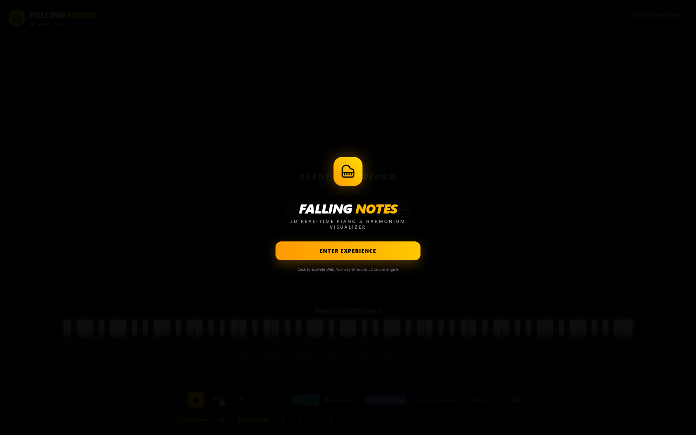
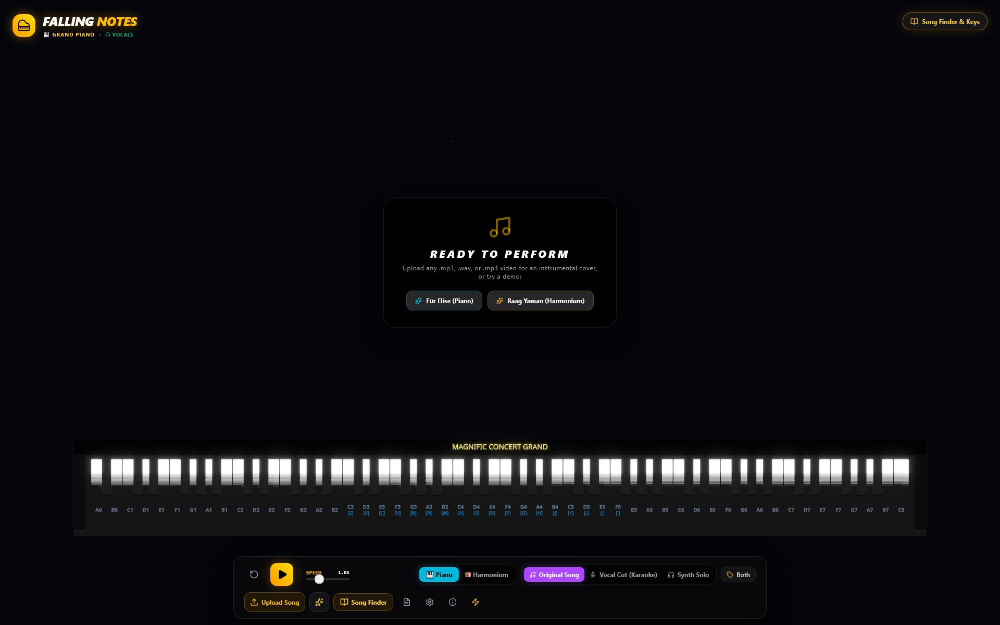
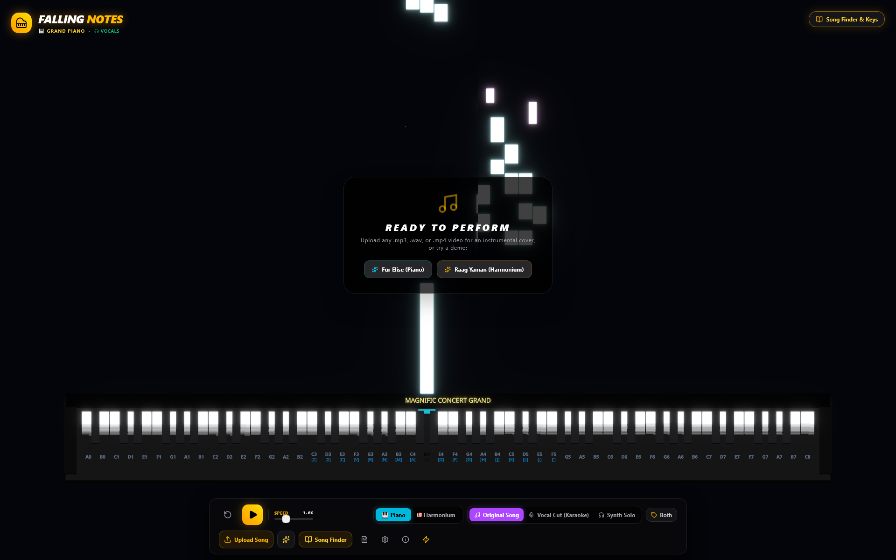
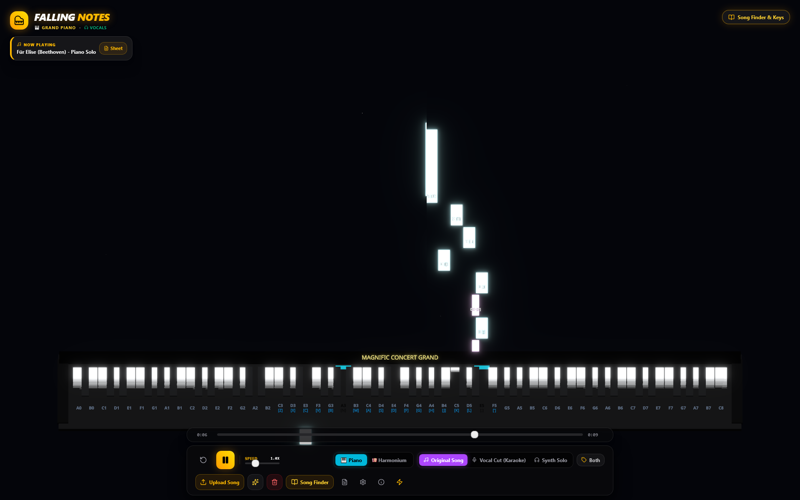
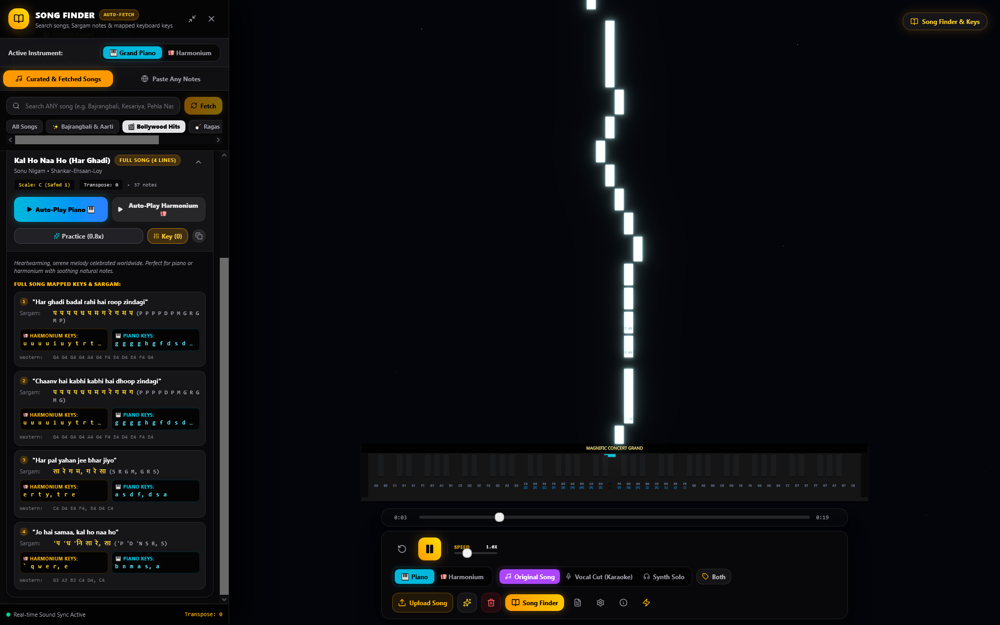
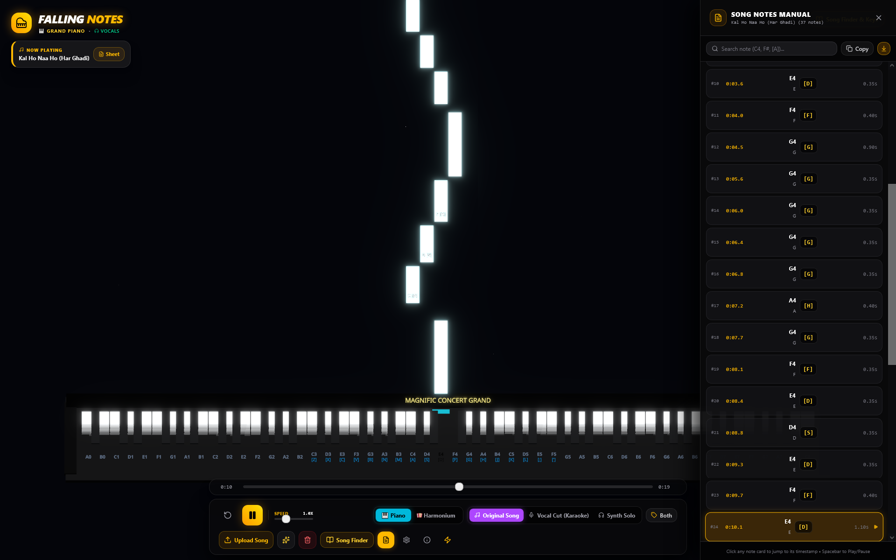

# 🎹 Falling Notes

> **Project Agnific Visual Core** — A real-time 3D musical performance and MIDI visualizer built with React 19, Three.js, and Tone.js.

[](https://react.dev/)
[](https://www.typescriptlang.org/)
[](https://threejs.org/)
[](https://tonejs.github.io/)
[](https://vite.dev/)
[](https://tailwindcss.com/)

---

## 🌟 Overview

**Falling Notes** is an interactive web-based 3D visualizer that turns musical performances and MIDI files into a neon, glowing visual experience. Designed for live performers, music educators, and visualizers, it renders falling notes synchronized with MIDI playback and rising notes for real-time live performances.

Whether connected to a physical USB/Bluetooth MIDI keyboard or played directly via your computer keyboard, Falling Notes delivers responsive audio synthesis and 3D graphics in the browser.

---

## 📸 Interface Showcase

| 🌟 1. Web Audio Experience Splash | 🎹 2. 3D Concert Grand Piano Stage |
| :---: | :---: |
|  |  |
| *One-click Web Audio initialization with modern responsive branding* | *Full 88-key physical layout, custom camera framing & floating control dock* |

| ✨ 3. Real-Time Cascading Note Bars | 🎶 4. Multi-Track Playback & Scrubber |
| :---: | :---: |
|  |  |
| *Glowing neon bars with impact light bursts and key depression physics* | *Live playback with time scrubber, pitch badges & synchronized key illumination* |

| 📖 5. Song Finder & Sargam Notes Panel | 📋 6. Interactive Song Notes Manual |
| :---: | :---: |
|  |  |
| *Full songs, Indian Sargam, dual-instrument Auto-Play & mapped keys* | *Timeline notes drawer with timestamps, key shortcuts & click-to-seek* |

---

## ✨ Key Features

- **🌌 3D Reactive Visualizer**
  - **MIDI Playback**: Synchronized cascading note bars that fall toward an 88-key piano keyboard.
  - **Live Performance**: Dynamic rising "fly-away" bars for real-time notes played via keyboard or MIDI controller.
  - **Postprocessing Bloom**: High-intensity emissive lighting, bloom shaders, and starfield atmosphere.
  - **3D Physics-like Piano**: Keys smoothly depress and illuminate with light bursts upon impact.
  - **Smart Viewport Resizing**: Dynamic camera framing automatically recenters the 3D scene when side drawers are opened.

- **🎼 Dual Sound Engine**
  - **Concert Grand Piano**: High-definition multi-sampled acoustic grand piano with natural decay, hammer impulse modeling, and convolution concert reverb.
  - **Authentic Indian Harmonium**: Multi-reed acoustic model with male reed (`fatsawtooth`), sub-octave bass reed (-12 semitones), octave coupler (+12 semitones), natural bellows air tremolo, lowpass wood cabinet filter, and hall reverb presets (*Dry*, *Mehfil*, *Darbar*).

- **🔍 Song Finder, Sargam Library & In-App Web Auto-Fetch**
  - **Curated Full Songs**: Pre-loaded catalog of complete songs (*Shree Hanuman Chalisa (Bajrangbali)* with all Dohas and Chaupais, *Kal Ho Naa Ho*, *Tum Hi Ho*, *Raag Yaman*, etc.).
  - **In-App Web Search & Auto-Fetch**: Search any song title or artist and auto-fetch the complete musical score, lyrics, Indian Sargam notation, and mapped keyboard keys directly in-app without clicking external links.
  - **Dual Instrument Auto-Play**: Dedicated `Auto-Play Piano 🎹` and `Auto-Play Harmonium 🪗` buttons on every song with mapped keys displayed for both instruments.
  - **Smart Sargam / Text Parser**: Paste custom Sargam (`S R G M P`), Hindi Swaras (`सा रे ग म`), Western notes, or keyboard sequences for immediate 3D visualization.

- **🎥 Audio & Video (.mp4 / .mp3 / .wav) Extraction & Auto-Play**
  - **Audio Extraction**: Direct in-browser extraction of audio tracks from uploaded `.mp4` video files and `.mp3`, `.wav`, `.ogg`, `.m4a` files using Web Audio API.
  - **Automatic Note Transcription**: Real-time client-side pitch frequency & onset detection converts the audio track into synchronized falling notes.
  - **Studio Audio Playback**: Plays the original audio in pristine quality while synchronizing cascading notes and illuminating the 3D keys on beat.

- **🔌 Web MIDI Hardware & Keyboard Input**
  - **Plug-and-Play MIDI Controllers**: Direct hardware integration using the browser's Web MIDI API (`navigator.requestMIDIAccess`).
  - **Computer Keyboard Support**: Full QWERTY keyboard mappings optimized for two distinct playing styles (Piano & Harmonium).
  - **Interactive 3D Touch/Click**: Click or drag directly across 3D keys with mouse or touchscreen.

- **🎛️ Playback & Audio Controls**
  - **Instant Built-in Demos**: One-click demo tracks for immediate testing (*Für Elise* on Piano and *Raag Yaman* on Harmonium).
  - **File Upload**: Load standard `.mid`, `.midi`, `.mp3`, `.wav`, and `.mp4` files.
  - **Playback Speed**: Adjust speed in real-time from `0.5x` up to `2.5x`.
  - **Real-time Transposition**: Transpose pitch on-the-fly across `±11` semitones.
  - **Octave Shifting**: Shift the active keyboard register between `1` and `5` octaves.

- **⚡ Performance Mode**
  - Instant one-click toggle to hide all UI overlays and stars for a clean, distraction-free stage or screen-recording display.

---

## 🎮 Controls & Keyboard Mapping

Open the on-screen **Keyboard Guide** (`Info` button in the control dock) at any time to review mappings.

### 1. Piano Mode

Mapped following standard DAW musical typing (GarageBand / Ableton / FL Studio):

| Row | Keys | Octave / Notes |
| :--- | :--- | :--- |
| **Home Row (Naturals)** | `A` `S` `D` `F` `G` `H` `J` `K` `L` `;` `'` | Octave 4 (`C4` through `F5`) |
| **Top Row (Sharps / Flats)** | `W` `E` (C#4, D#4), `T` `Y` `U` (F#4, G#4, A#4), `O` `P` (C#5, D#5) | Accidentals naturally placed above key gaps |
| **Bottom Row (Bass)** | `Z` `X` `C` `V` `B` `N` `M` | Lower register bass notes (`C3` through `B3`) |

### 2. Harmonium Mode (Indian Classical Sargam)

Traditional Indian harmonium layout centered around Safed 1 (C4 = Sa):

| Key Type | Keys | Swara / Notes |
| :--- | :--- | :--- |
| **Shuddha Swaras (White Keys)** | `E` `R` `T` `Y` `U` `I` `O` `P` | Sa (सा), Re (रे), Ga (ग), Ma (म), Pa (प), Dha (धा), Ni (नि), Sa' (सां) |
| **Komal & Tivra Swaras (Black Keys)** | `4` `5` (re, ga), `7` (tivra Ma'), `8` `9` (dha, ni), `-` `=` (re', ga') | Komal & Tivra swaras |
| **Mandra Saptak (Pre-Octave)** | `` ` `` (G3), `1` (G#3), `Q` (A3), `2` (A#3), `W` (B3) | Lower octave notes |

### 3. MIDI Hardware

1. Plug in your USB or Bluetooth MIDI keyboard before or after opening the app.
2. Grant MIDI device permission when prompted by your browser.
3. Play any key — velocity sensitivity and note duration are processed automatically.

---

## 🛠️ Tech Stack

| Category | Technology |
| :--- | :--- |
| **Framework & UI** | [React 19](https://react.dev/), [TypeScript](https://www.typescriptlang.org/) |
| **Bundler & Tooling** | [Vite 8](https://vite.dev/), [PostCSS](https://postcss.org/), [Tailwind CSS v4](https://tailwindcss.com/) |
| **3D Rendering** | [Three.js](https://threejs.org/), [@react-three/fiber](https://r3f.docs.pmnd.rs/), [@react-three/drei](https://github.com/pmndrs/drei) |
| **Postprocessing** | [@react-three/postprocessing](https://github.com/pmndrs/react-postprocessing), [postprocessing](https://github.com/pmndrs/postprocessing) |
| **Audio Engine** | [Tone.js](https://tonejs.github.io/), [@tonejs/midi](https://github.com/Tonejs/Midi) |
| **State Management** | [Zustand](https://zustand.docs.pmnd.rs/) |
| **Icons & Animation** | [Lucide React](https://lucide.dev/), [Framer Motion](https://www.framer.com/motion/) |

---

## 🚀 Getting Started

### Prerequisites

- [Node.js](https://nodejs.org/) (version `18.0` or higher recommended)
- `npm`, `pnpm`, or `yarn`

### Installation

1. Clone or download the repository:
   ```bash
   git clone https://github.com/RasikhAli/Falling-Notes.git
   cd Falling-Notes
   ```

2. Install dependencies:
   ```bash
   npm install
   ```

### Development

Start the local Vite development server:

```bash
npm run dev
```

Open [http://localhost:5173](http://localhost:5173) in your browser. Click **"Enter Experience"** on the initial splash screen to activate the Web Audio engine.

### Production Build

Compile TypeScript and build the optimized production bundle:

```bash
npm run build
```

Preview the production build locally:

```bash
npm run preview
```

### Linting

Run ESLint to check for code quality and style issues:

```bash
npm run lint
```

---

## 📁 Project Structure

```text
FallingNotes/
├── public/                 # Static assets (favicons, icons)
├── src/
│   ├── assets/             # Project assets & styles
│   ├── components/
│   │   ├── Controls.tsx    # Playback, upload, speed, & settings dock
│   │   ├── NoteBars.tsx    # 3D instanced mesh for falling & rising note bars
│   │   ├── Piano.tsx       # 3D 88-key piano keyboard with reactive keys
│   │   └── Visualizer.tsx  # Three.js Canvas, camera setup, stars, & bloom
│   ├── hooks/
│   │   └── useInput.ts     # Keyboard event listeners & Web MIDI API handler
│   ├── store/
│   │   └── MIDIStore.ts    # Zustand global state (notes, playback, mode, transpose)
│   ├── utils/
│   │   ├── AudioEngine.ts  # Tone.js sampler, synth voices, & reverb effects
│   │   └── Constants.ts    # 88-key layout geometry, dimensions, & note types
│   ├── App.tsx             # Root layout, HUD overlays, modals, and animation loop
│   ├── index.css           # Global Tailwind CSS definitions
│   └── main.tsx            # Application entry point
├── eslint.config.js        # ESLint flat config
├── index.html              # HTML template
├── package.json            # Project manifest & dependencies
├── tsconfig.json           # TypeScript configuration
└── vite.config.ts          # Vite build configuration
```

---

## 🌐 Browser Compatibility

- **Audio**: Requires a browser supporting the [Web Audio API](https://developer.mozilla.org/en-US/docs/Web/API/Web_Audio_API) (Chrome, Edge, Firefox, Safari).
- **Web MIDI**: Supported in Google Chrome, Microsoft Edge, Opera, and Chromium-based browsers. (Firefox and Safari do not natively support Web MIDI without extensions or flags).
- **Graphics**: WebGL 2.0-enabled hardware acceleration recommended for optimal 60 FPS bloom rendering.

---

## 📄 License

This project is private and proprietary to **Agnific**. All rights reserved.
